# Data Science on Prometheus Metrics
## **Table of Contents**
1. [Metric Types](#metrics)
2. [Metadata Analysis](#metadata)
3. [Data Preprocessing](#preprocessing)
4. [Time Series Forecasting](#forcasting)
5. [Anomaly Detection Decision Rules](#ad)
6. [Anomaly Detection for Histograms and Summaries](#ad-hist-summ)
7. [Conclusion](#conclusion)
## **The Metrics** 
#### Anatomy of Metrics
For more information, visit https://prometheus.io/docs/concepts/metric_types/

Gauge Metric for a given target:
  * a time series

Counter Metric for a given target:
* a monotonically increasing time series

Histogram Metric for a given target:
* *a collection of bucket time series* -  n buckets in the histogram correspond to n time series. the +Inf bucket time series is the same as the count time series.
* *a count time series* -
a cumulative count of all observations we have seen thus far
* *a sum time series* - a cumulative sum of all observations we have seen thus far

Summary Metric for a given target:
* *quantile time series* - there are n quantiles corresponding to n time series
* *count time series* - a cumulative count of all observations we have seen thus far
* *sum time series* - a cumulative sum of all observations we have seen thus far

#### Key Insights on Metrics
1. The value of a counter is useless - the instantaneous value of a counter is dependent on when Prometheus decides to reset the counter. it is often not indicative of the state of the system. Counters are only useful when we look at how they change over time. For this reason, when we talk about a counter we will automatically preprocess the counter into a difference series where difference(t) = raw(t) - raw(t-1)
2. The metrics are received and stored in the form of packets. All quantile packets are stored in a quantile folder, all count packets in a count folder, etc. We parse these packets and reformat them into dictionaries for each time series type and metric. The key refers to the metadata (target info and metric contents labels) and the value is a pandas dataframe with timestamp and value for each unique metadata configuration. Essentially each key-value pair represents a single incoming time series. For more information, check out [this notebook]()

## **The Metadata**

A given time series is assigned a unique metadata label configuration which includes user-specified and default labels. We used some basic visualization techniques for metadata analysis including graphing and dimensionality reduction.

One of the default labels that occurs in every metric and metadata packet is the instance. The instance is an ip which corresponds to the scraped target. However, these ip addresses are refreshed over time. In the graphs below, we can see that certain instances pop up and go away at different times. Because the instance change typically results from one or two targets going down, most instances are re-assigned simultaneously which means that we cannot pinpoint the continuity between the old and new instance labels.

Metadata analysis scripts can be found in [this folder](https://github.com/nfrumkin/forecast-prometheus/tree/master/metadata_analysis).
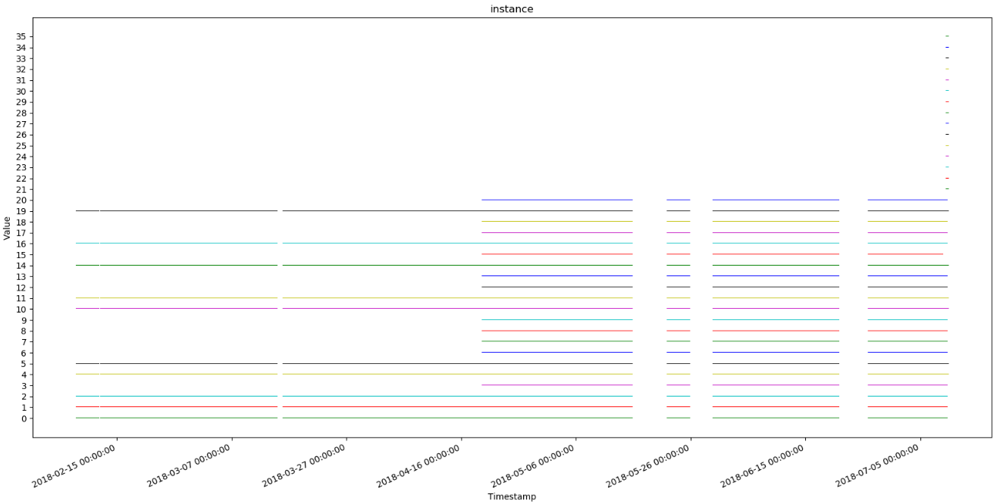
**Graph 1:** instance values over time for all targets of kubelet_docker_operation_latency_microseconds_quantile. Every value on the y-axis corresponds to a specific instance ip address (ex: ip-172-31-70-31.us-east-2.compute.internal)

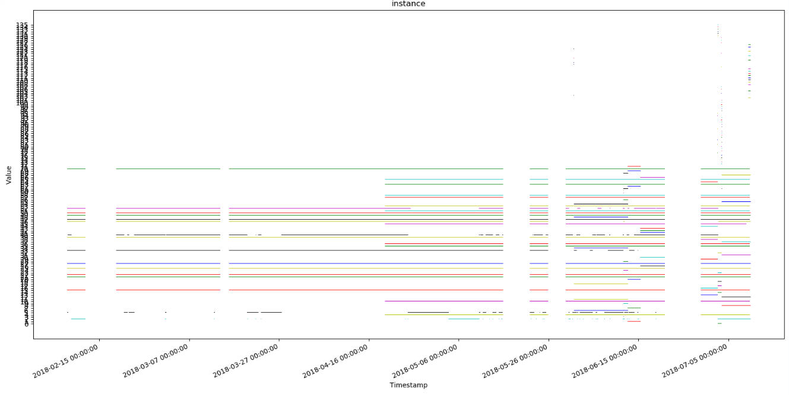
**Graph 2:** instance values over time for all targets of cloudprovider_aws_api_request_duration_seconds. Every value on the y-axis corresponds to a specific instance ip address (ex: ip-172-31-70-31.us-east-2.compute.internal)

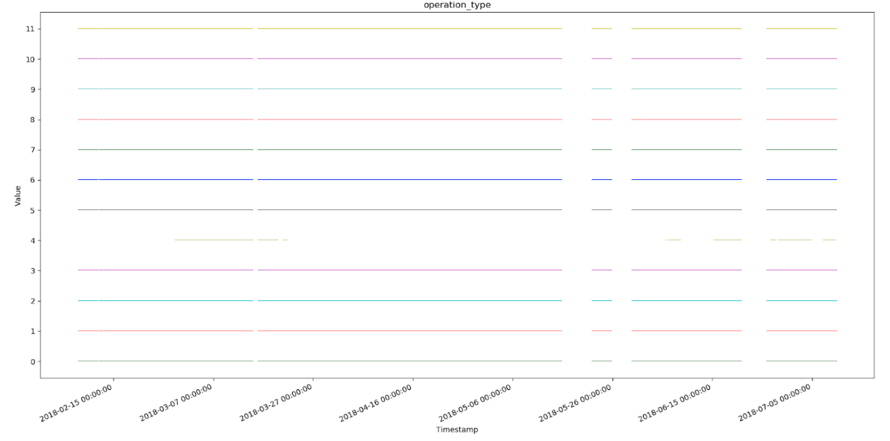
**Graph 3:** operation_type values over time for all targets of kubelet_docker_operation_latency_microseconds_quantile. legend provided below. Note that all operation_types exist for all timestamps except for remove_image.
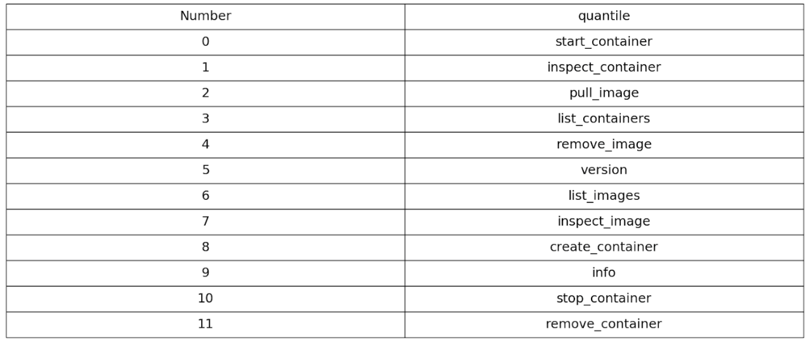

#### T-SNE Embedding of dataset
T-sne embedding is a dimensionality reduction technique used for mapping high dimensional data into a lower dimension for visualization. In this case, our dimensions are labels in the metadata. We use a standard t-sne package from sci-kit learn and represented our categorical data in terms of numerical values from 1 to len(label values). The result is shown below.

[Here](https://github.com/nfrumkin/forecast-prometheus/blob/master/metadata_analysis/t_sne_for_metadata.py) is the script for generating these visualizations.
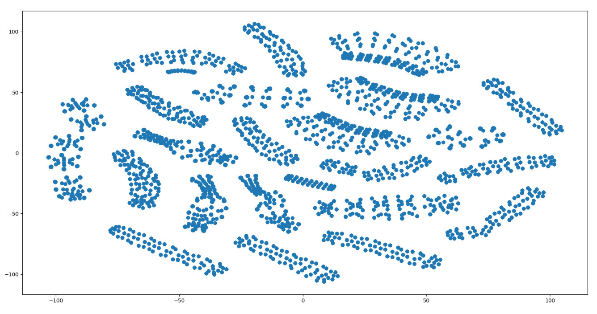
**Graph 4:** t-sne embedding for all data points in kubelet_docker_operation_latency_microseconds_quantile. Note that the data seems to be clustered in some way.
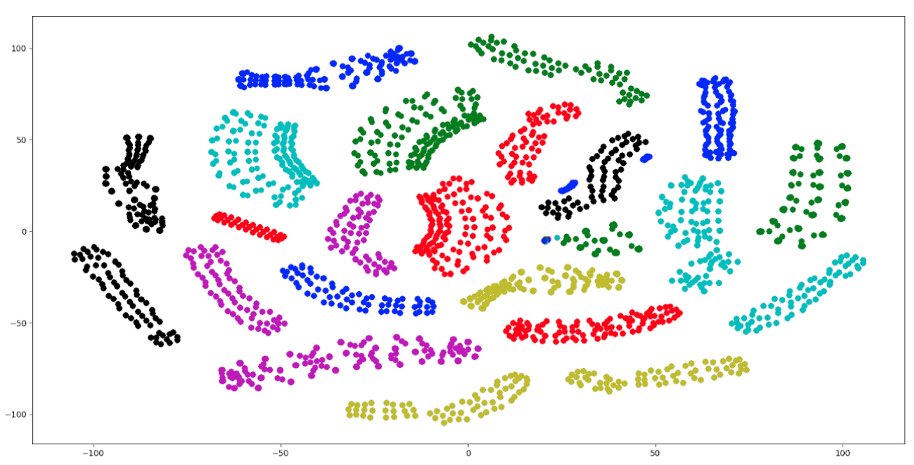
**Graph 5:** t-sne embedding for all data points in kubelet_docker_operation_latency_microseconds_quantile colored by instance (there are too many intances for colors, so colors are re-used). Note that the coloring corresponds to the clustering which indicates that our data is likely clustered by instance.

## **Data Preprocessing**
In order to run forecasting and time series analysis on our Prometheus data, we had to reformat the metric packets received from Prometheus into a format which can be fed into a forecasting model. We found Pandas DataFrames to be very useful for this purpose.

I designed a script that will convert a collection of json files in a specified directory into a dictionary of DataFrames housed in a Pickle file.

**Input Format**: a directory which houses .json or .json.bz2 files. Each of these files may contain one or more json packets. These files can be taken directly from a local folder or remotely from a Ceph folder (additional configuration may need to be completed for Ceph retrieval). These json files are intended to be taken from a single metric.

**Output Format**: a pickle file which houses a dictionary of Pandas DataFrames. The keys are the metadata configurations in a string format. To use this output, here are a few helpful commands:

`data_dictionary = pickle.load(my_output_file)`

`data_dictionary["{'__name__': 'kubelet_docker_operations_latency_microseconds','beta_kubernetes_io_arch': 'amd64'..."]`

**Run Pre-processing using the sample Bash Script**

`./run_formatter`

**Or Manually using the Command Line Arguments**

`python format_to_pandas.py --metric METRIC --format FORMAT --input INPUT_DIR --output OUTPUT_DIR`

for more information about the command line arguments, use the help message

`python format_to_pandas.py --help`

[this](https://docs.google.com/spreadsheets/d/1CB14X5xd1dPH2x9m_ko_2rfz6BrilPZPYcJA_kQWBUo/edit?usp=sharing) spreadsheet has a working list of metrics and their associated data sparsity
## **Forecasting**

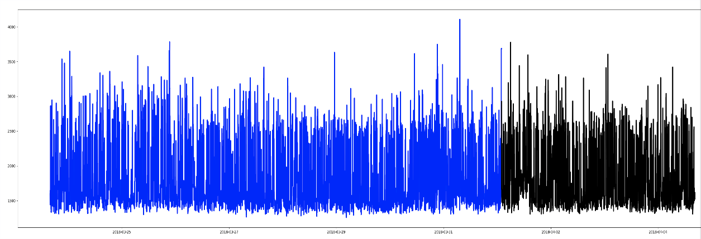
**Graph 6:** A time series from kubelet_docker_operations_latency_microseconds with the following metadata: *{'name': 'http_request_duration_microseconds', 'app': 'openshift-web-console', 'handler': 'prometheus', 'instance': '10.129.0.18:8443', 'job': 'kubernetes-service-endpoints', 'kubernetes_name': 'webconsole', 'kubernetes_namespace': 'openshift-web-console', 'quantile': '0.9'}*
#### Exponential Smoothing
[This notebook](https://github.com/nfrumkin/forecast-prometheus/blob/master/notebooks/Exponential%20Smoothing%20and%20ARIMA%20on%20Real%20Data.ipynb) has an introduction to Exponential Smoothing and a few examples.
The implementation for this model came from the [statsmodels python package](http://www.statsmodels.org/dev/tsa.html)
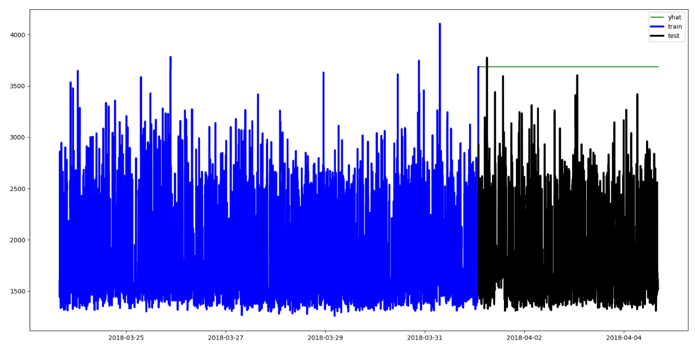
**Graph 7:** Exponential Smoothing on a Time Series. Note that the forecast (yhat) remains the same as the last training value. This means that we do not take into account the seasonality or volatility of the series using this model.
#### ARIMA Modelling
[This notebook](https://github.com/nfrumkin/forecast-prometheus/blob/master/notebooks/ARIMA%20modelling.ipynb) has an introduction to ARIMA and a few examples of ARIMA modelling.
The implementation for this model came from the [statsmodels python package](http://www.statsmodels.org/dev/tsa.html).
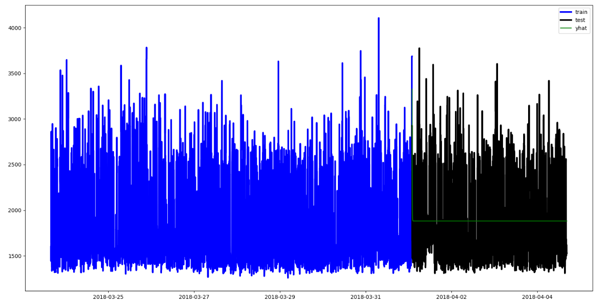
**Graph 8:** ARIMA Modelling on a Time Series. Note that the forecast (yhat) decays to the median very quickly. It seems that this model does not take into account the seasonality of the data. For this example, we used ARIMA(1,0,1).
#### Prophet Modelling
[This notebook](https://github.com/nfrumkin/forecast-prometheus/blob/master/notebooks/Prophet%20Model%20Forecasting.ipynb) has an introduction to Prophet and a few examples of Prophet modelling.[Here](https://peerj.com/preprints/3190.pdf) is Facebook's paper on Prophet modelling
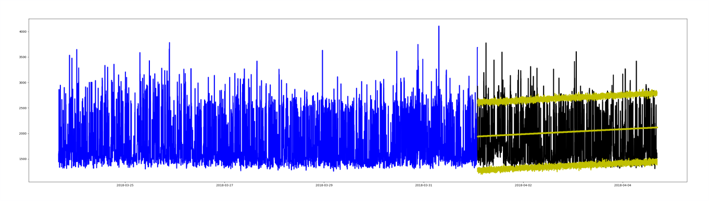
**Graph 9:** Prophet Modelling on a Time Series. Note that the model seems to train according to trend, and the bounds (yhat_upper and yhat_lower) are reasonably accurate. This specific example likely provides too little data for Prophet to detect anomalies accurately.
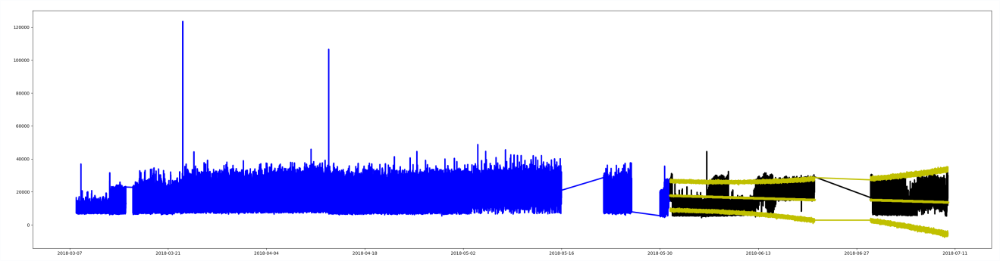
**Graph 10:** Prophet Modelling on a Time Series from kubelet_docker_operations_latency_microseconds. Notice how there are large gaps in the training and testing data. This is characteristic of many of the time series we get from Prometheus because there are often dead times in the systems. Prophet seems to handle these gaps pretty well.
#### Fourier Extrapolation
[This notebook](https://github.com/nfrumkin/forecast-prometheus/blob/master/notebooks/Fourier%20Analysis%20Forecasting.ipynb) has an introduction to Fourier Analysis and a few examples.
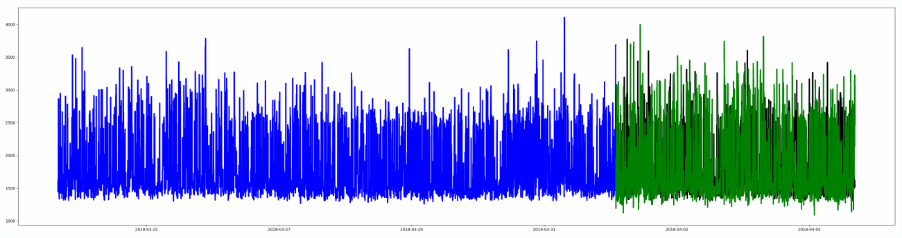
**Graph 11:** Fourier Extrapolation on a Time Series. Note that this model does an excellent job of reproducing the seasonality of the training set. It responds very well when there is a clear pattern in the data.
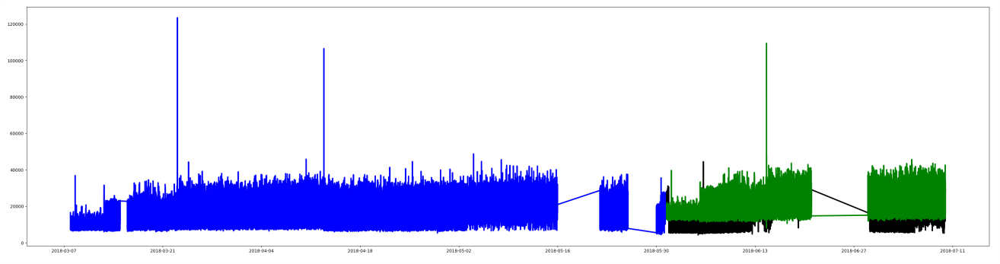
**Graph 12:** Fourier Extrapolation on a Time Series from kubelet_docker_operations_latency_microseconds. Note that this forecast seems to be shifted upwards and reproduces the point-wise peaks in the traning set.
#### Model Comparisons
Comparing Prophet and Fourier
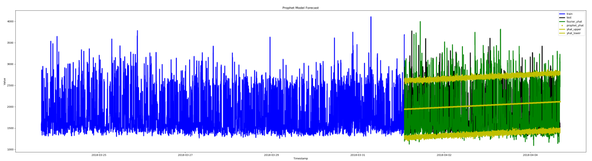
**Graph 13:** A Comparison between Prophet and Fourier for a time series from kubelet_docker_operations_latency_microseconds. Prophet does a good job of predicting the mean, while Fourier accurately predicts the seasonality of the data.
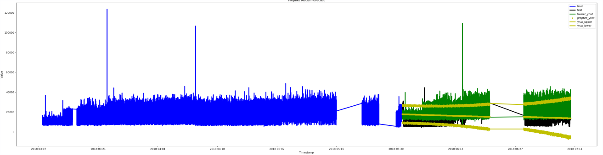
**Graph 14:** A Comparison between Prophet and Fourier for a time series from kubelet_docker_operations_latency_microseconds. Prophet does a good job of predicting the mean, while Fourier accurately predicts the seasonality of the data.
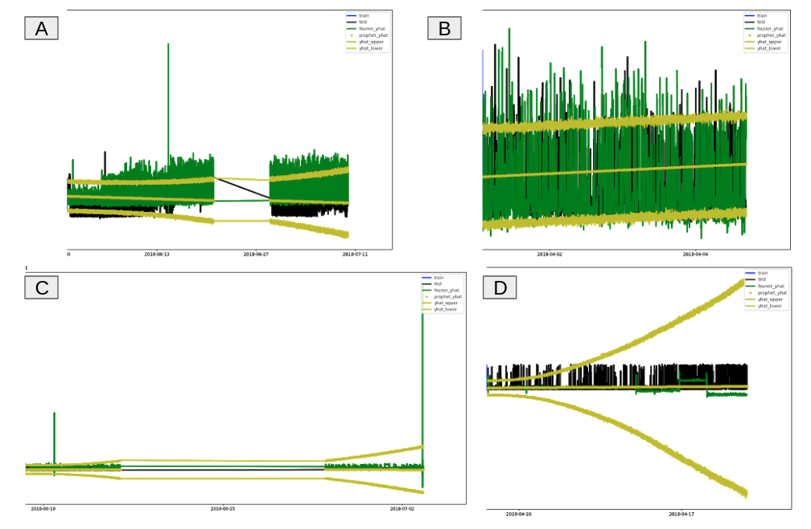
**Graph 15:** A Comparison between Prophet and Fourier for a time series from kubelet_docker_operations_latency_microseconds. A and B are the same forecasts from above, while C and D represent two specific types of data. C had a training set with a few point-wise extremes. We can see here that Fourier is very sensitive to those extremities and will attempt to model them in the forecast, while Prophet does a good job of identifying the mean. In D, we have a training set which has a drastic change in seasonality halfway through. Again, Prophet seems rather robust against that sudden change while Fourier continues the original pattern with a slight variation.
#### Further Research
* RNNs (LSTMs)
* Generalization to additional metrics
* Verification from domain experts
## **Anomaly Detection Decision Rules**
[This notebook](https://github.com/nfrumkin/forecast-prometheus/blob/master/notebooks/Anomaly%20Detection%20Decision%20Rules.ipynb) provides details on our anomaly detection decision rules that we've employed.

## **Anomaly Detection for Histograms and Summaries** 
#### **Histogram and Summary Visualization**
Let's begin by taking a look at the graphs of histogram and summary components over time.

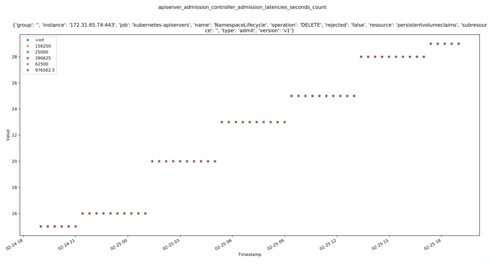
**Graph 18:** The buckets of apiserver_admission_controller_admission_latencies_seconds_count over time. While at first glance it looks like there is only the 976562.5 bucket, this is actually a graph of all the buckets. The buckets are all the same values. This indicates that the buckets are likely to be mis-configured, but are nevertheless, treated as the same value for our uses in anomaly detection.
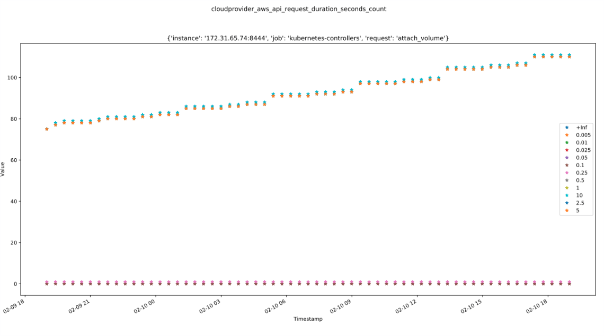
**Graph 19:** The buckets of cloudprovider_aws_api_request_duration_seconds over time. From this graph we can see that a majority of the time series raw data values lie in between 0.25 and 10.
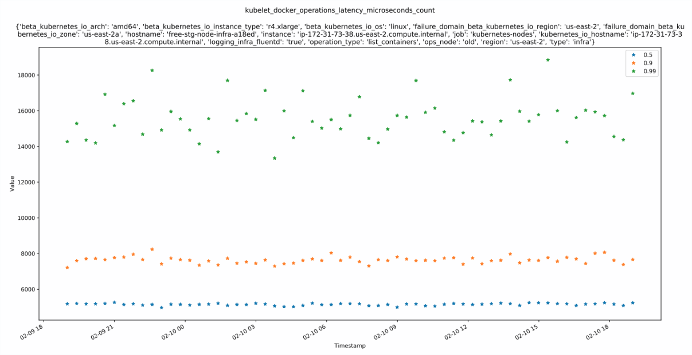
**Graph 20:** The quantiles of kubelet_docker_operations_latency_microseconds over time. The 0.5 quantile will always be below the 0.9 quantile which will always be below the 0.99 quantile.
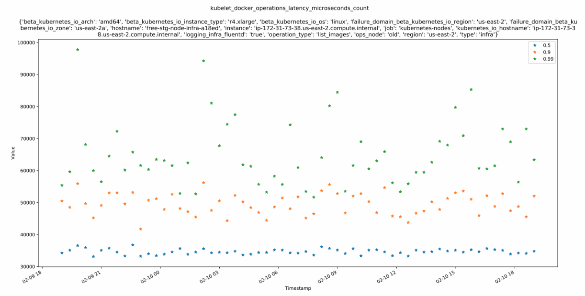
**Graph 21:** The quantiles of kubelet_docker_operations_latency_microseconds over time. Notice that the 0.99 quantile is much more volatile than the median. This is because the 0.99 quantile represents the extreme values whereas the 0.5 quantile represents the median which is often much more stable.
#### **Key Observations**
Histograms and Summaries can be seen as a collection of gauges and counters. We can take each quantile/bucket, count, and sum as an individual time series and apply anomaly detection on them individually, or we can apply some sort of anomaly detection based on their correlation.

#### **Anomaly Detection Rule Outline**
Below is an example of an alerting decision scheme for Summary metric alerting. It can also be extended to Histogram metric alerting by replacing the quantiles with buckets.
Let's assign the function AD(time series) to be the following:

    AD (time series):
	    Return True if anomaly detected
	    Return False otherwise

Let's define quantiles is the set of all time series quantiles.
Below is a block decision chain for when to send an alert if there is an anomaly detected in some set of the time series.

    If 0.5 ∈ quantiles:
      If AD(0.5) OR [ AD(quant1) AND AD(quant2) AND AD(quant3) ] :       (∀ quant1, quant2, quant3 ∈ quantiles)
          Send alert
      Else if AD(quant1) AND AD(quant2):                                 (∀ quant1, quant2 ∈ quantiles)
          Send alert
      If AD(sum) AND AD(count):
	      Send alert
      Else if AD(quant) AND [ AD(sum) OR AD(count) ] :                   (∀ quant ∈ quantiles)
	      Send alert

## **Conclusion** 
My project aimed to explore the connections between metadata labels, time series forecasting, and anomaly detection in an attempt to gain valuable quantitative insights on Prometheus metrics. The summer started with a dive into Spark and Prophet Modelling. We found Spark to be very clunky for quick analysis of Prometheus data, so next we moved to local data with Pandas DataFrames. With these DataFrames, we applied various metadata analysis and forecasting techniques to our data.

In addition to the analysis here, my teammates worked on deploying a real-time anomaly detection pipeline on Prometheus metrics for sending automatic alerts to developers.

For future work, we would like to do more forecast and anomaly detection testing on a variety of metrics. Since we have the pipeline working, this will probably require setting up real-time anomaly detection for different targets and monitoring them in Grafana.
